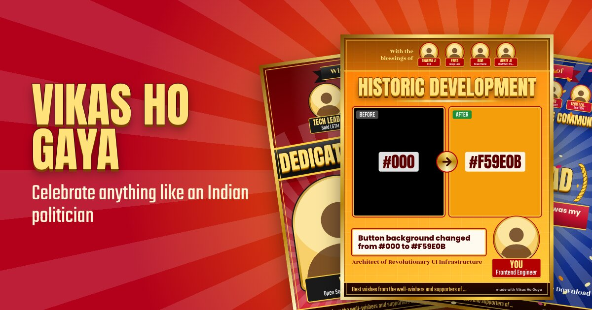
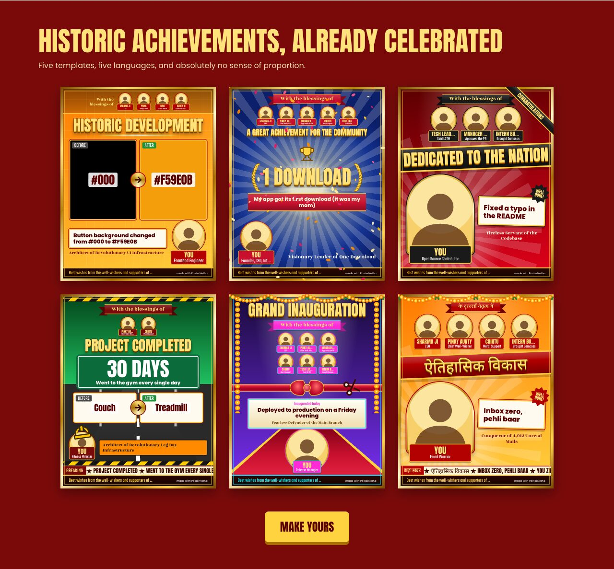
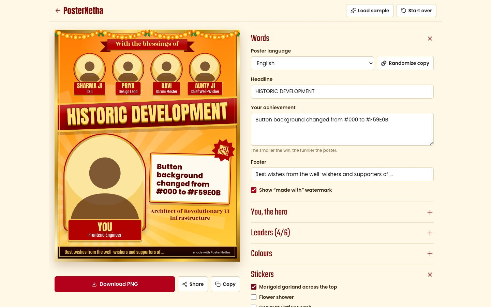

# PosterNetha

**Celebrate anything like an Indian politician.**

Turn your tiniest win into a giant, over-the-top political-style flex banner: gold frames, garlands, "With the blessings of" ribbons, a row of leaders, and your face in the middle of it all. Fix a typo, get one download, go to the gym once, then download a poster the whole colony will talk about.



> Parody. Not affiliated with any political party. Photos never leave your device.

---

## Features

- **Five templates**: Blessings, Inauguration, Achievement, Development, Infrastructure. Switching templates keeps everything you've typed.
- **Your photos, your leaders**: upload a hero photo and up to 6 "leaders", then zoom and pan each one inside its frame.
- **Five poster languages**: English, ಕನ್ನಡ, हिन्दी, தமிழ், తెలుగు. The language picker translates the preset headline and blessings label; anything you typed yourself is left alone.
- **Randomize copy**: one click for a new headline, blessings label and tagline.
- **Five colour themes**: Saffron Gold, Royal Blue, Emerald Green, Crimson Red, Neon Startup.
- **Stickers**: marigold garland, flower shower, "Congratulations" corner sash, scrolling breaking-news ticker.
- **Before and after panels**: upload two photos, or just type labels. A hex colour like `#F59E0B` paints the whole panel, for the "changed a button colour" flex.
- **Export**: download a 2160×2700 PNG (4:5, sized for Instagram and X), share via the phone's share sheet, or copy the image to the clipboard.
- **Private by design**: no backend, no accounts, no uploads. Photos are resized and rendered entirely in the browser.

The editor only shows the inputs the selected template uses (for example, the big number only appears for Achievement and Infrastructure).

## Screenshots

**The templates** (all rendered live on the landing page):



**The editor** (`/create`): the poster preview stays in place while the inputs scroll.



## Tech stack

| | |
|---|---|
| Framework | [Next.js 16](https://nextjs.org) (App Router, static export), React 19, TypeScript |
| Styling | [Tailwind CSS v4](https://tailwindcss.com) |
| Export | [`html-to-image`](https://github.com/bubkoo/html-to-image) |
| Icons | [`lucide-react`](https://lucide.dev) |
| Confetti | [`canvas-confetti`](https://github.com/catdad/canvas-confetti) |
| Fonts | Anton, Teko, Rozha One, Poppins and Noto Sans (Devanagari, Tamil, Telugu, Kannada) via `next/font` |
| Package manager | [bun](https://bun.sh) |

## Getting started

Requires [bun](https://bun.sh) 1.3 or later.

```bash
bun install
bun dev
```

Open <http://localhost:3000>. The editor lives at <http://localhost:3000/create>.

### Scripts

| Command | What it does |
|---|---|
| `bun dev` | Start the dev server |
| `bun run build` | Build the static site into `out/` |
| `bunx serve@latest out` | Preview the production build (`bun start` / `next start` doesn't work with static export) |
| `bun run lint` | Run ESLint |
| `bun scripts/check.ts` | Run the logic checks (file naming, language switching) |

## Configuration

Everything site-wide lives in [`src/lib/config.ts`](src/lib/config.ts): the site name, tagline, disclaimer, watermark text and social links.

| Environment variable | Purpose |
|---|---|
| `NEXT_PUBLIC_SITE_URL` | Absolute base URL used for link-preview (OG / Twitter) images, e.g. `https://posternetha.com`. On Vercel it falls back to the project's production URL; otherwise `http://localhost:3000`. |

## Project structure

```
src/
  app/
    page.tsx              landing page (hero, example gallery)
    create/page.tsx       editor route
    layout.tsx            fonts and site metadata
    globals.css           Tailwind setup + shared poster utilities
    opengraph-image.jpg   link-preview image
    icon.svg, favicon.ico, apple-icon.png
  components/
    editor/               editor UI: Editor (state), ExportBar, ImageSlot, pickers, fields
    poster/
      PosterCanvas.tsx    fixed 1080x1350 stage, scaled to fit its container
      templates/          one component per template
      parts/              shared pieces: GoldFrame, Ribbon, LeaderBadge, HeroMedallion,
                          BeforeAfter, Stickers, Footer, Photo, Silhouette, ...
  lib/
    types.ts              PosterData, Person, TemplateId, Lang
    presets.ts            templates, themes, copy in every language, sample poster
    reducer.ts            editor state (pure reducer)
    export.ts             PNG export
    images.ts             upload -> downscaled data URL
    examples.ts           landing-page example posters
    config.ts             site name, links, URLs
scripts/check.ts          assert-based logic checks
plan/PLAN.md              build plan and design decisions
BACKLOG.md                deliberately out of scope for v1
```

## How it works

### The poster stage

Every poster renders on a **fixed 1080×1350 px stage**. `PosterCanvas` scales that stage to fit its container with a CSS transform, and exports always come from the unscaled stage, so the preview and the PNG are the same layout at any screen size.

- A template is a React component that receives `PosterData` and lays it out. Templates share parts (frame, ribbons, badges, before/after, footer) so they stay consistent.
- Themes are CSS variables (`--bg-from`, `--bg-to`, `--accent`, `--plate`, `--text`) set on the stage.
- Poster styles use **pixel values** (`p-[18px]`, `text-[38px]`), not Tailwind's rem spacing scale, so the stage doesn't change with the viewer's browser font size.
- Long or shared poster styles live as `@utility` classes in `globals.css`. `gold-text` is the 3D gold headline used by every template.

### Export

`src/lib/export.ts` waits for fonts to load, renders the stage with `html-to-image` at 2× (falling back to 1× on low-memory devices), and renders twice, keeping the second result, because Safari often misses images or fonts on the first pass. Only local fonts and data URLs are used, so nothing is fetched from other sites.

### Photos

Uploads are downscaled in the browser to 1200 px on the long edge and stored as data URLs in memory. They're never sent anywhere. Panning slides the photo inside its frame and zoom scales around the same point, so every part of the photo is reachable and the frame never shows gaps.

## Extending

### Add a template

1. Add its id to `TemplateId` in [`src/lib/types.ts`](src/lib/types.ts).
2. Create `src/components/poster/templates/YourTemplate.tsx`. Start from an existing one and reuse the parts in `parts/`.
3. Register it in the `TEMPLATES` map in [`PosterCanvas.tsx`](src/components/poster/PosterCanvas.tsx).
4. Add it to `TEMPLATES` in [`src/lib/presets.ts`](src/lib/presets.ts), setting `bigNumber` / `beforeAfter` to whether it renders those. The editor uses these flags to show the right inputs.
5. Check it with 0 and 6 leaders, no photos, and very long text.

### Add a language

1. Add the code to `Lang` in `types.ts`.
2. Add an entry to `COPY` in `presets.ts` (name, headlines, blessings labels, congrats, breaking). Keep headlines and labels in the same order as the other languages; switching language maps them by position. The picker lists languages in the order of `COPY`.
3. If the script needs a new font, add a Noto Sans font in `layout.tsx` and append its variable to the font stacks in `globals.css`.

### Add a colour theme

Add an entry to `THEMES` in `presets.ts`.

## Deployment

The site is fully static (`output: "export"`): run `bun run build` and host the `out/` folder on any static host. Set `NEXT_PUBLIC_SITE_URL` to your domain so link previews use it.

Share and Copy only appear on HTTPS (they need a secure context), so test them on a deployed preview rather than on your local network.

## Known limitations

- **Safari export** hasn't been verified on real Safari yet. In Playwright's WebKit engine the exported PNG lost the headline's 3D shadow. If real Safari does the same, the fix goes in the `gold-text` utility.
- **Background removal** was cut from v1 (license and model size); see [`BACKLOG.md`](BACKLOG.md).

## Author

Made by Harshith. Follow along on [X](https://x.com/HarshithAshvi) and [Instagram](https://www.instagram.com/astroashvi.mp4/).
